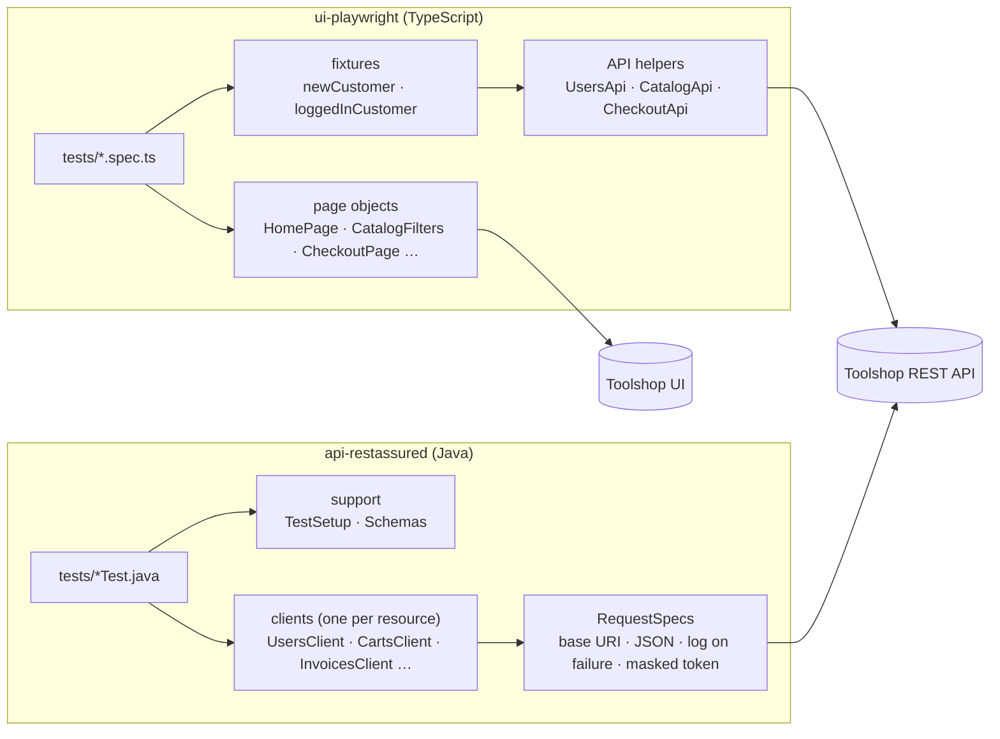
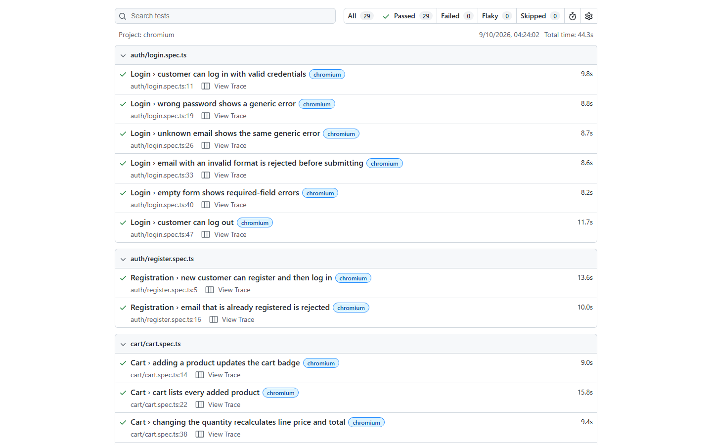
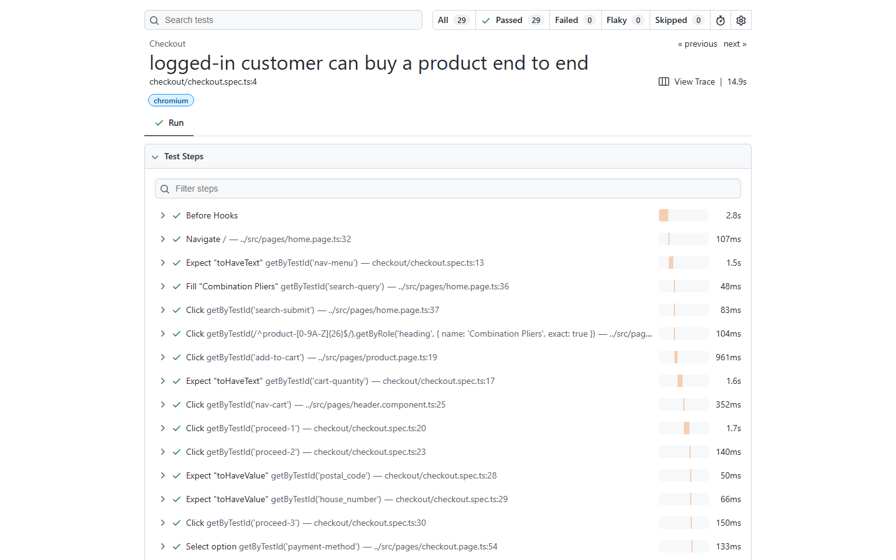
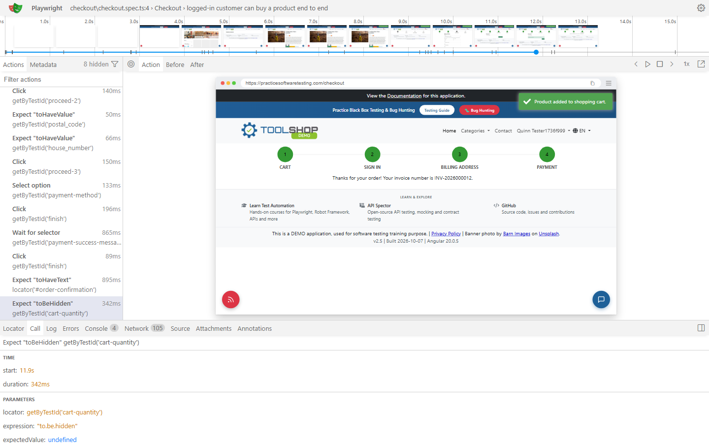
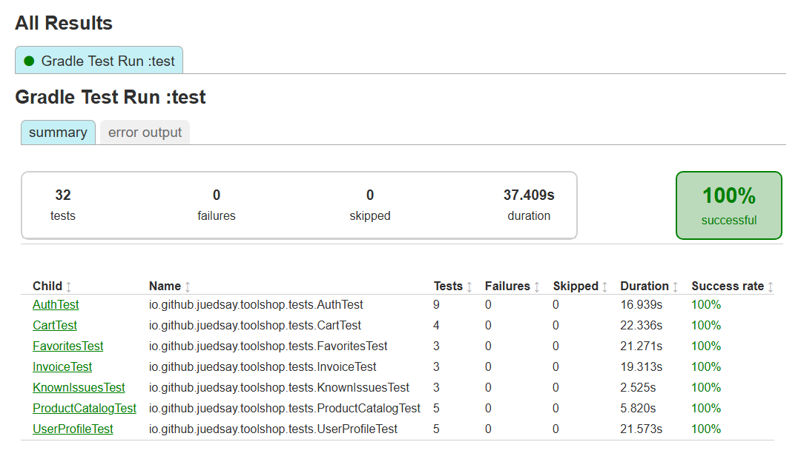

# QA Automation Showcase

[](https://github.com/juedsay/qa-automation-showcase/actions/workflows/ci.yml)
[](https://juedsay.github.io/qa-automation-showcase/)


End-to-end and API test automation for **[Toolshop](https://practicesoftwaretesting.com)**, a public
demo e-commerce app built for testing practice. Two suites run in CI on every push, plus a
documented experiment with **Playwright Test Agents** (AI planner, generator and healer) where I
record what I kept, fixed and threw away.


| | |
|---|---|
| **UI suite** | Playwright + TypeScript · Page Object Model · fixtures · 28 tests, incl. 2 cross-layer (UI ⇄ API) |
| **API suite** | Java 21 · RestAssured · JUnit 6 · JSON Schema contracts · 32 tests |
| **CI** | GitHub Actions · secret scanning · UI suite against a disposable Toolshop in Docker |
| **Findings** | 4 real defects in the app, each kept as an executable test ([below](#defects-found)) |
| **AI** | Playwright Test Agents: 9 proposals → 6 kept after review → [decision log](ai-agents/DECISIONS.md) |

**[Open the live test report →](https://juedsay.github.io/qa-automation-showcase/)**

---

## Contents

- [What is tested](#what-is-tested)
- [Architecture](#architecture)
- [Defects found](#defects-found)
- [How I used AI agents](#how-i-used-ai-agents)
- [CI](#ci)
- [Run it locally](#run-it-locally)
- [Repository layout](#repository-layout)

## What is tested

**UI (Playwright)**: login and logout, registration, product search and detail, category,
brand, price-range and eco-friendly filters, sorting across pages, cart (add, quantity, remove),
and a full checkout down to the invoice number.

**API (RestAssured)**: auth and JWT, profile updates (PUT/PATCH) and authorization (a customer
cannot touch another customer), catalog and pagination, full CRUD of carts and favorites,
cart-to-invoice checkout with prices checked against the catalog, and negative cases (401, 403,
404, 409, 422). Responses are validated against JSON Schemas, including one that fails if a
password ever appears in a user payload.

**Cross-layer**: an order placed in the UI is verified through the API, and an order placed
through the API must show up in the customer's invoices page.

Principles behind both suites:

- **Every test owns its data.** Toolshop is shared with everyone practicing on it, so each test
  registers its own customer and cleans up what the API lets it delete. No test depends on order,
  on fixed IDs or on the public demo accounts.
- **Assertions are relational, not memorized.** "Prices are ascending", "every product belongs
  to the selected brand (according to the API)", rather than "the first product is X".
- **Waits follow what the user sees.** Web-first assertions and polling on the rendered list; no
  sleeps, no waiting on network calls whose shape the app can change.

## Architecture



- **UI**: page objects hold locators and actions; specs hold the assertions. Test data is set up
  through the API (`newCustomer`, `loggedInCustomer`), which is faster and less flaky than going
  through forms.
- **API**: one client per resource with the request specification injected (anonymous or
  authenticated). Clients only send requests; tests assert. Payloads are Java records mapped to
  the API's snake_case.

## Defects found

Each defect is kept as an **executable record**: the test asserts the correct behavior and is
marked as expected to fail (`test.fail()` in Playwright, a characterization test in Java). It
stays green while the defect exists and turns red the day it is fixed.

| # | Defect | Impact | Test |
|---|---|---|---|
| 1 | Registration accepts any password length, but the login form caps it at 40 characters. | A customer can create an account they can never log into through the UI. | [password-length.spec.ts](ui-playwright/tests/known-issues/password-length.spec.ts) |
| 2 | `POST /brands`, `/categories` and `/products` reach validation without a token (422 instead of 401), while `DELETE` correctly returns 401. | Anyone can create catalog data. Field evidence: the shared site's brand list fills up with junk brands from other users. | [KnownIssuesTest.java](api-restassured/src/test/java/io/github/juedsay/toolshop/tests/KnownIssuesTest.java) |
| 3 | After the "X" reset, the sort dropdown still shows the previous sort, but the list is reloaded unsorted (the reset request carries no sort). | The UI shows a sort that is not applied. | [reset-keeps-stale-sort.spec.ts](ui-playwright/tests/known-issues/reset-keeps-stale-sort.spec.ts) |
| 4 | Each price-slider change sends a product request, and the app renders whichever response arrives **last**, even a stale one. | Under latency the list can show products outside the selected price range. Reproduced deterministically by delaying the older response. | [price-filter-stale-response.spec.ts](ui-playwright/tests/known-issues/price-filter-stale-response.spec.ts) |

Defect 3 was surfaced by the healer agent; defect 4 by running the suite against a faster local
backend in CI, which exposed a race the public site hid.

## How I used AI agents

I used the **Playwright Test Agents** (Playwright 1.63) on a flow I had not automated by hand:
catalog sorting and filtering. The agents ran headless through Claude Code with an explicit tool
allow-list, and nothing they wrote reached `tests/` without review.

| Stage | Output | What I did with it |
|---|---|---|
| Planner | 9 scenarios | Kept 6. Dropped 3 that overlapped existing coverage or were combinatorial. |
| Generator | 6 test files | 2 passed, 4 failed on first run. Moved duplicated locators into a component, removed data-dependent constants, replaced network waits. |
| Healer | 4 fixes | Accepted 2, replaced 1 with a sturdier wait, and split the 4th: it had (correctly) refused to hide a real defect. |

What they were good at: **exploration**. In minutes they found the keyboard-operable slider, that
the app queries with the HTTP `QUERY` method, the junk brands, and the reset defect.
What needed a human: **test design for a shared environment**: data-dependent constants, network
coupling, duplicated locators, and plan steps that asserted nothing ("record the behavior").
Total agent cost: USD 3.41.

Full log of every proposal and decision: **[ai-agents/DECISIONS.md](ai-agents/DECISIONS.md)**.

## CI

[`.github/workflows/ci.yml`](.github/workflows/ci.yml) runs on every push and pull request:

| Job | What it does |
|---|---|
| Secret scan | gitleaks over the full git history |
| UI tests | Starts a disposable Toolshop from the official images ([`ci/toolshop/`](ci/toolshop/)), runs the suite, uploads the HTML report |
| API tests | Runs the RestAssured suite against the public API, uploads the Gradle report |

Why a local Toolshop for the UI job: the public site shows a Cloudflare bot check to GitHub's
datacenter IPs. Rather than trying to get around it, CI runs against its own instance, which is
also deterministic (fresh seed, no third-party data) and keeps load off the shared site.

Hardening: read-only token, every third-party action pinned to a commit SHA, Docker images pinned
by digest, Gradle wrapper pinned by checksum, pnpm with a 7-day release cooldown and install
scripts blocked.

<details>
<summary>Screenshots</summary>

**Playwright HTML report**



**Test steps**



**Trace viewer**



**API suite (Gradle report)**



</details>

## Run it locally

**UI suite** (Node 22+, [pnpm](https://pnpm.io)):

```bash
cd ui-playwright
pnpm install --frozen-lockfile
pnpm exec playwright install --with-deps chromium
pnpm test            # against the public site
pnpm report          # open the HTML report
```

**API suite** (JDK 21; the Gradle wrapper downloads Gradle):

```bash
cd api-restassured
./gradlew test       # report: build/reports/tests/test/index.html
```

**Against a local Toolshop**, as CI does (Docker required):

```bash
bash ci/toolshop/start.sh
TOOLSHOP_BASE_URL=http://localhost:4200 TOOLSHOP_API_URL=http://localhost:8091 pnpm --dir ui-playwright test
./api-restassured/gradlew -p api-restassured test -Dtoolshop.apiUrl=http://localhost:8091
docker compose -p toolshop down -v
```

## Repository layout

```
ui-playwright/      Playwright + TypeScript suite (page objects, fixtures, API helpers, tests)
api-restassured/    Java + RestAssured + JUnit 6 suite (clients, records, schemas, tests)
ai-agents/          Playwright Test Agents run: plan, raw output, healer diff, decisions
ci/toolshop/        Disposable Toolshop stack used by CI
.github/workflows/  CI pipeline
docs/assets/        GIF and screenshots used in this README
```

## About

Built by **Julian Simon**, QA Automation Engineer (Argentina, open to remote work).
Toolshop is © Testsmith and is used here only as the system under test; it is not redistributed
or hosted by this project. This repository's own code is released under the [MIT License](LICENSE).
